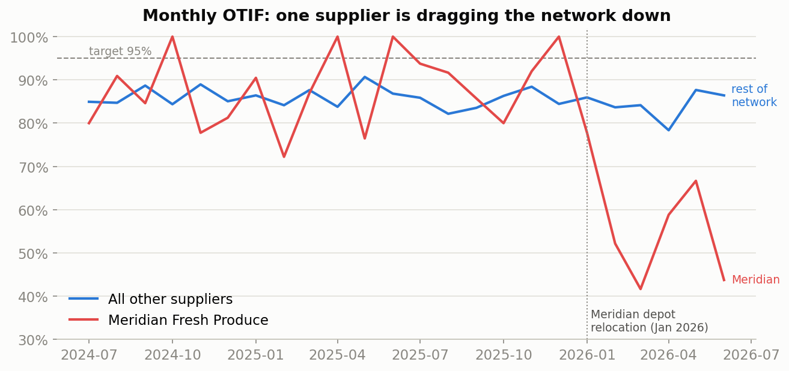
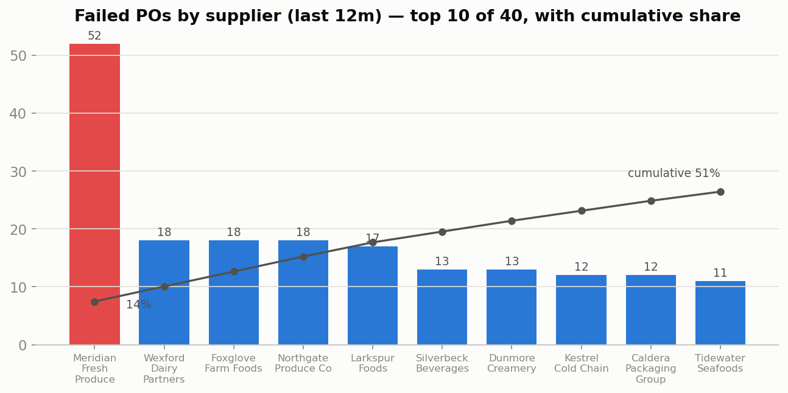
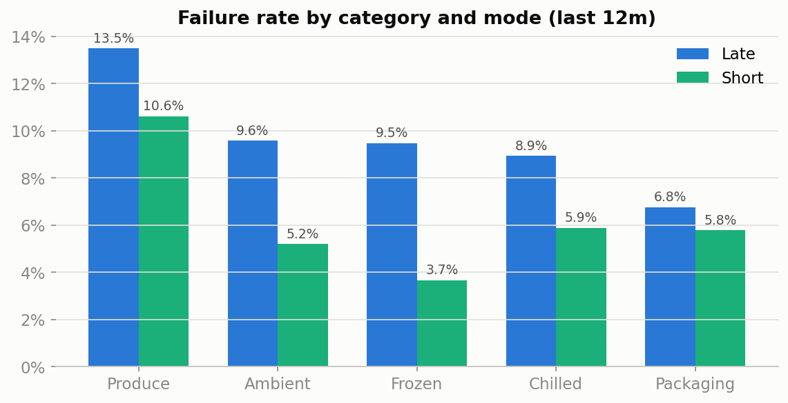
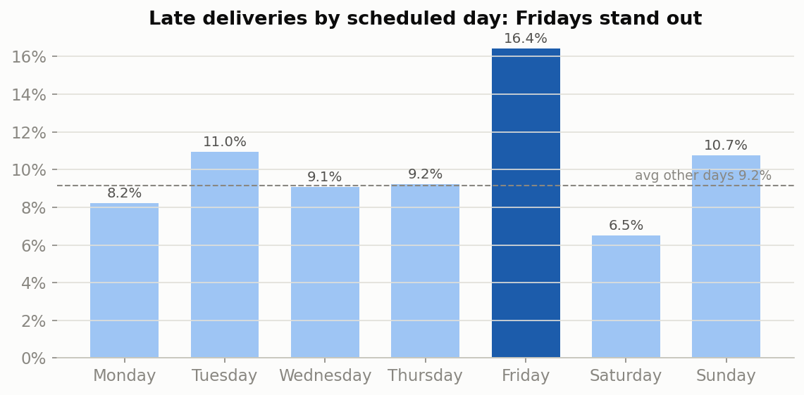
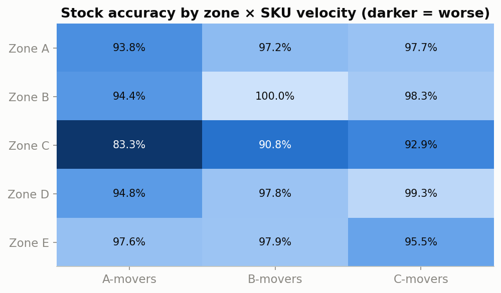

# 01 — Supply Chain OTIF & Stock Accuracy Analysis

End-to-end analysis of supplier on-time-in-full (OTIF) performance and inventory accuracy across a multi-supplier distribution operation — from raw purchase-order data through SQL investigation to recommendations you could act on Monday morning.

## The Business Question

> *Why are we missing OTIF targets, and where should we focus to recover the most ground with the least effort?*

This is the kind of question I worked through repeatedly as a Supply Chain Analyst at NERVI Enterprises and Business Operations Analyst at F.Costa & Son. This project recreates that workflow on a simulated dataset (see [Dataset](#dataset)).

## Key Findings

**Headline: OTIF is 83.8% against a 95% target (362 failed POs in 12 months) — but the miss is heavily concentrated, which makes it recoverable.**

**1. One supplier explains most of the 2026 deterioration.** Meridian Fresh Produce — the operation's biggest supplier — fell from 87.5% to 57.4% OTIF after its January 2026 depot relocation, and now accounts for 14% of all failed POs on its own.



**2. Failures follow a Pareto curve: 5 of 40 suppliers drive 34% of failures; the top 10 drive over half.** Supplier recovery effort can be focused on a short list instead of spread across the whole base.



**3. Produce fails differently — it short-ships.** Produce is the worst category on both failure modes (77.1% OTIF), and it's the only category where short-shipping (10.6%) rivals lateness. That points at fill/field-availability issues with growers — a different fix than "deliver on time".



**4. Some of the lateness is self-inflicted: Friday deliveries run 16.4% late vs 9.2% on other days.** Suppliers don't collectively get worse on one weekday — this is a receiving-capacity constraint on our side, and rebalancing delivery slots is free.



**5. Stock accuracy (95.7% vs 98% target) breaks down exactly where picking traffic is heaviest.** Zone C — the high-velocity pick face — sits at 90.3%, and its fastest movers at 83.3%, while most of the warehouse is at or near target.



## Recommendations

1. **Meridian recovery plan** — joint weekly-review recovery plan tied to the depot relocation; the single biggest lever.
2. **Focus supplier management on the top 10** — they carry >50% of failures.
3. **Produce fill-rate programme** — order-quantity buffers or dual-sourcing for the worst growers.
4. **Rebalance Friday delivery slots** — shift inbound volume to quieter days.
5. **Weekly (not monthly) cycle counts for Zone C A-movers** — count where records actually break.

Items 1, 2 and 4 together address roughly half of current OTIF failures — enough to recover to the low 90s before touching the long tail.

## Approach

1. **KPI definition first** — OTIF and stock accuracy locked down before any querying ([docs/kpi-definitions.md](../../docs/kpi-definitions.md)). This analysis uses the strict variants: full quantity on/before the expected date; zero count variance.
2. **SQL analysis** — supplier ranking by *recovery opportunity* (volume × failure rate, not OTIF % alone), trend isolation, failure-mode segmentation, and root-cause tests ([sql/](./sql)).
3. **Exploratory notebook** — the full walk-through with charts and narrative ([notebooks/01_otif_stock_accuracy_analysis.ipynb](./notebooks/01_otif_stock_accuracy_analysis.ipynb)).
4. **Recommendations** — sized against the failure counts they address.

## Files

- [`sql/`](./sql) — five analysis queries (PostgreSQL-flavoured; run as-is on DuckDB)
- [`notebooks/`](./notebooks) — executed analysis notebook (pandas + matplotlib)
- [`data/`](./data) — dataset generator and the generated sample data
- [`images/`](./images) — charts produced by the notebook

## Dataset

**Fully simulated, and transparent about it.** [`data/generate_data.py`](./data/generate_data.py) (seeded, reproducible) generates 24 months of purchase orders across 40 suppliers plus 12 months of warehouse cycle counts, modelled on a UK food & drink distribution operation. The patterns in it — a supplier degrading after a depot move, produce short-shipping, a receiving-day bottleneck, zone-concentrated stock variance — are shapes I met repeatedly in live operations, recreated with invented names, volumes and dates. No real company data is used.

To reproduce from scratch:

```bash
cd data && python generate_data.py        # regenerates data/sample/*.csv
cd ../notebooks && jupyter nbconvert --to notebook --execute --inplace 01_otif_stock_accuracy_analysis.ipynb
```

## Stack

- **SQL** — analysis queries (PostgreSQL syntax, executed on DuckDB)
- **Python** — pandas, matplotlib (data generation + exploratory analysis)
