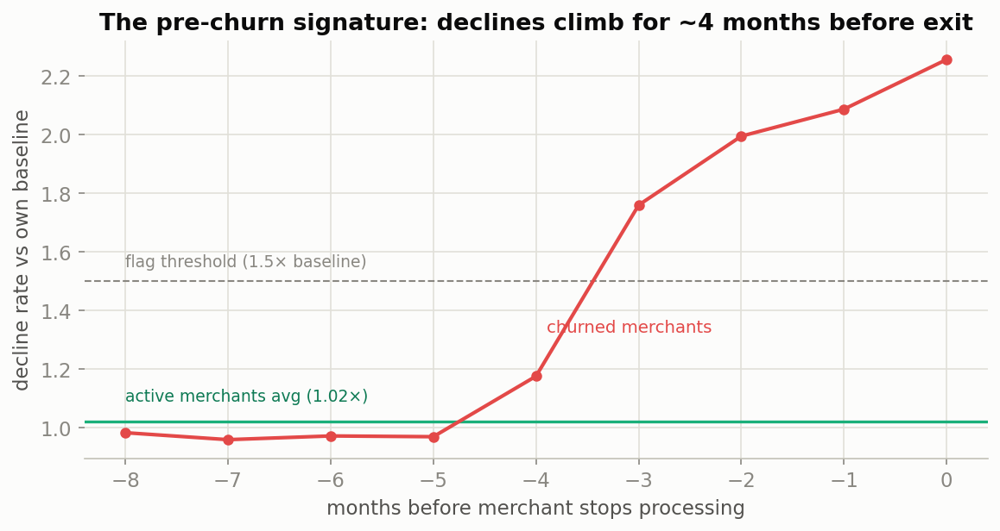
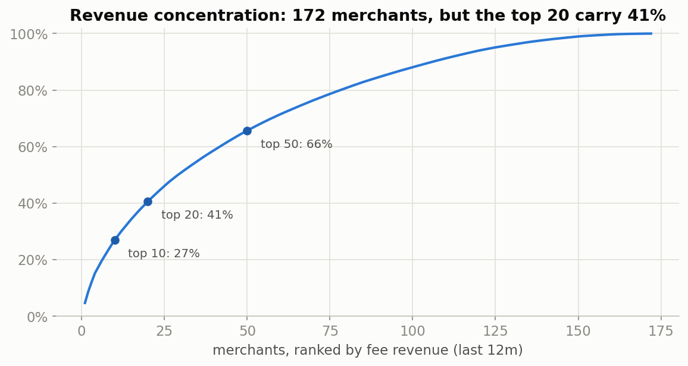
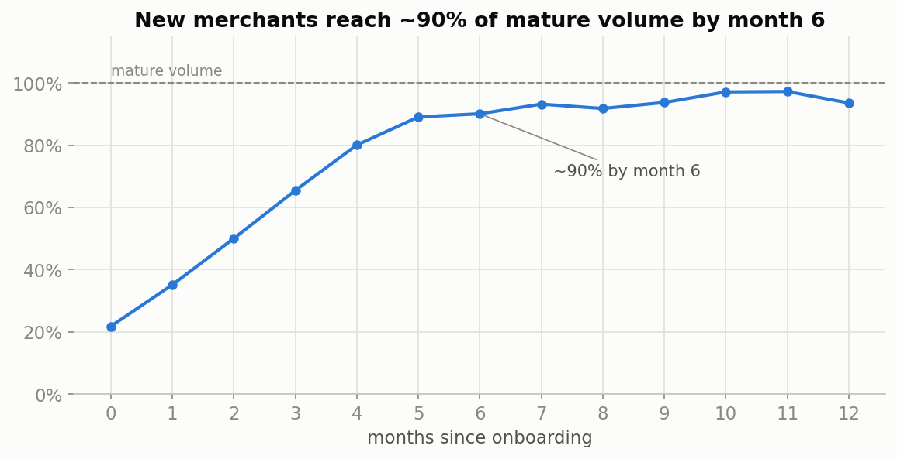
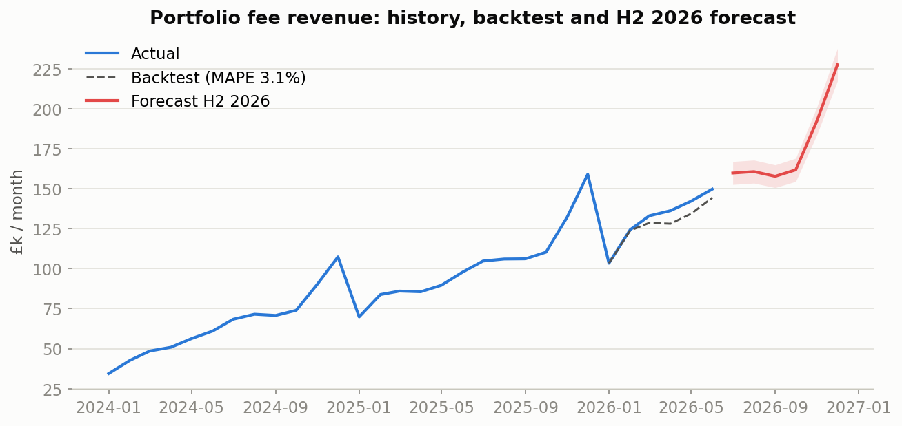

# 02 — Merchant Performance & Forecasting

Performance monitoring, churn early-warning and revenue forecasting for a merchant-acquiring portfolio — replicating the merchant analytics work I led at IMB Financial Services, end-to-end.

## The Business Question

> *Which merchants are trending toward problems before the numbers say so, and how confident can we be in next half's revenue forecast?*

## Key Findings

**Headline: a £1.5m/year fee-revenue book growing +51% YoY — and a simple, explainable early-warning rule that catches 21 of 22 merchant churns a median of 2 months before they happen.**

**1. Churn announces itself in the decline rate.** Merchants that stop processing show card-decline rates diverging from their own baseline about four months before exit — averaging over 2× baseline in the final months, while healthy merchants sit flat at ~1×.



**2. A two-consecutive-months rule turns that signature into a worklist.** Flag any merchant whose decline rate runs ≥1.5× its own trailing 6-month baseline for two months running. Validated against every churn in the window: **21/22 caught, median 2 months of warning, false alarms on only 0.6% of healthy merchant-months.** Four active merchants are flagged today — ~£27k of annualised fee revenue at risk, sized and ranked for the account team.

**3. Concentration makes early warning worth it: the top 20 of 172 merchants carry 41% of fee revenue.** The flagged list is always cross-checked against the top tier — one top-20 flag outweighs the whole tail.



**4. New merchants reach ~90% of mature volume by month 5–6.** The ramp curve phases pipeline revenue realistically, and a merchant far below the curve at month 4 is itself a flag.



**5. H2 2026 fee revenue forecast: ~£1.06m ± £48k (95%).** Holt-Winters with multiplicative seasonality, honestly backtested: trained on Jan 2024–Dec 2025, it predicted the six months we already know with **3.1% MAPE** before being trusted with the future. December's seasonal peak (~£229k) is the month to resource for.



## Approach

1. **Scorecard first** — volume, ATV, decline rate and fee yield per merchant with MoM/YoY movement ([sql/01](./sql/01_merchant_scorecard.sql)); the table a weekly review starts from.
2. **Prove the signature, then codify it** — establish that pre-churn behaviour exists in the data, then express the flag rule in plain SQL window functions ([sql/02](./sql/02_decline_early_warning.sql)) so it can run inside any reporting pipeline, and validate it like a classifier (catch rate, lead time, false-alarm rate).
3. **Cohort and concentration context** ([sql/03](./sql/03_cohort_ramp.sql), [sql/04](./sql/04_revenue_concentration.sql)).
4. **Backtest before forecast** — no forecast is quoted without showing how it performed on months we already know.

The full narrative is in the notebook: [notebooks/01_merchant_performance_forecasting.ipynb](./notebooks/01_merchant_performance_forecasting.ipynb).

## Files

- [`sql/`](./sql) — four analysis queries (PostgreSQL-flavoured; run as-is on DuckDB)
- [`notebooks/`](./notebooks) — executed analysis notebook (pandas, statsmodels, matplotlib)
- [`data/`](./data) — dataset generator and generated sample data
- [`images/`](./images) — charts produced by the notebook

## Dataset

**Fully simulated, and transparent about it.** [`data/generate_data.py`](./data/generate_data.py) (seeded, reproducible) generates ~185 merchants across five sectors and 30 months of monthly processing metrics, with deliberately seeded structure: a pre-churn decline signature, cohort ramp curves, sector seasonality (retail Q4, travel summer) and a concentrated revenue top tier. These are the shapes I worked with in live merchant analytics, recreated with invented names, volumes and dates. No real company data is used.

To reproduce from scratch:

```bash
cd data && python generate_data.py        # regenerates data/sample/*.csv
cd ../notebooks && jupyter nbconvert --to notebook --execute --inplace 01_merchant_performance_forecasting.ipynb
```

## Stack

- **SQL** — scorecard, early-warning flags, cohort and concentration analysis (PostgreSQL syntax, executed on DuckDB)
- **Python** — pandas, statsmodels (Holt-Winters forecasting), matplotlib

**Next step:** a Tableau executive dashboard on the same data model — scorecard, flag list and forecast on one screen.
