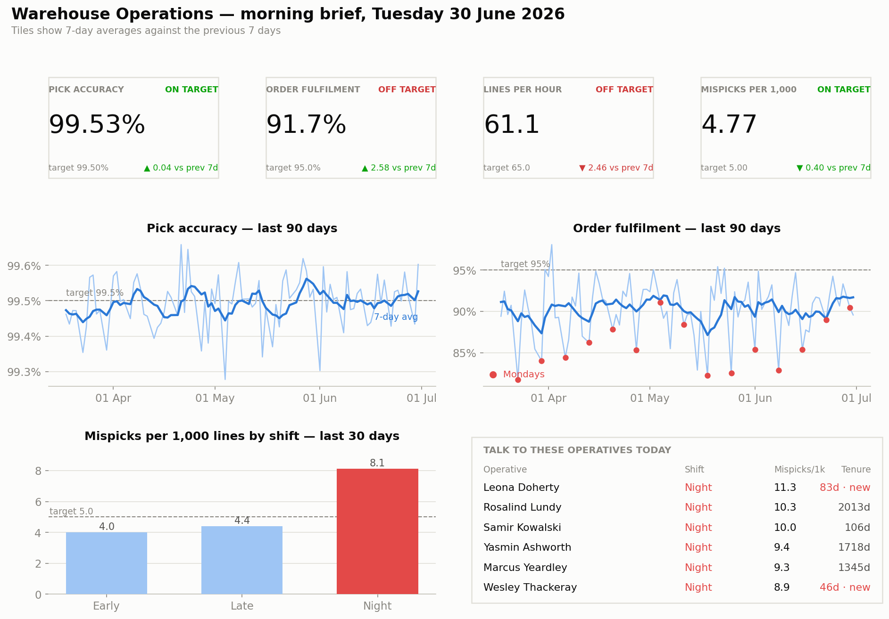
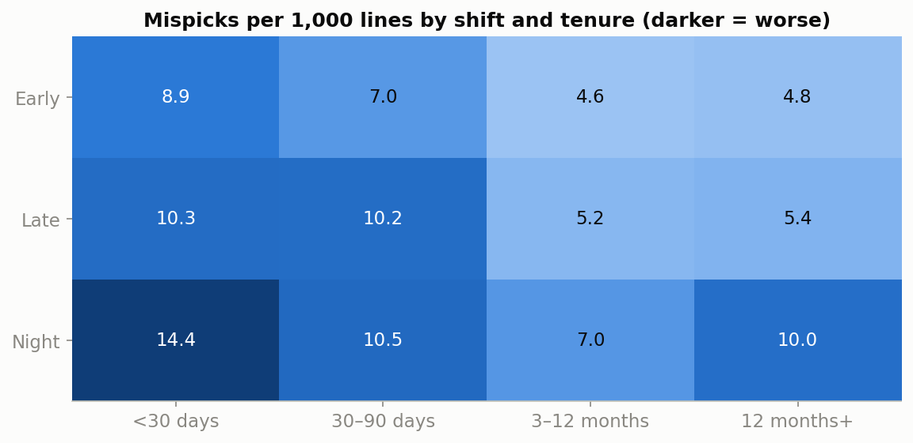
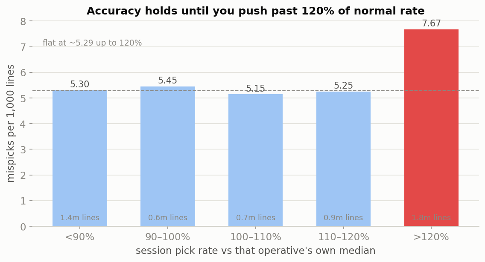
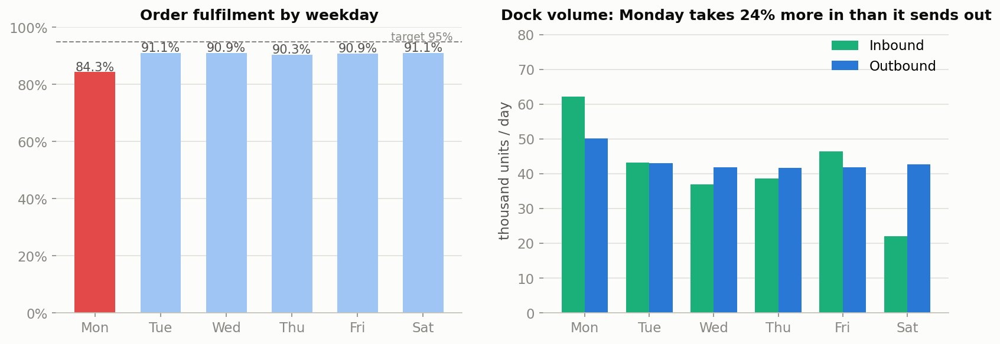

# 03 — Warehouse KPI Dashboard

An operational dashboard tracking pick accuracy, order fulfilment, productivity and dock throughput — designed for the warehouse floor, not the boardroom.

## The Business Question

> *Can a warehouse supervisor walk in at 7am, look at one screen, and know what to fix today?*

This project is built to that brief. It draws on my own experience as a Warehouse Manager at Nervi Distributions, where the gap between "report exists" and "report gets used" usually came down to one thing: whether the dashboard answered the questions a supervisor actually asks.

A supervisor has about ninety seconds before the shift briefing, so the screen answers three questions in order — **are we on target, which way are we moving, and who do I talk to this morning?** Everything that doesn't serve one of those three was left off.

## The Dashboard



Four KPI tiles with target status and week-on-week movement, two trends, the shift breakdown, and — the part that makes it get used — **a named worklist of the six operatives to speak to today**, with the two facts that make the conversation useful: their error rate and whether they're still new.

## Key Findings

**Headline: pick accuracy is on target at 99.53%, but fulfilment (91.7% vs 95%) and productivity (61.1 vs 65 lines/hour) are not — and both misses trace to specific, fixable causes rather than general underperformance.**

**1. Two independent accuracy effects that compound.** Night shift runs 9.80 mispicks per 1,000 lines against 5.29 on Early and Late (1.9×), at every tenure band. Separately, operatives under 90 days run 9.25 against 5.85 for established staff (1.6×) while picking 27% slower. The worst cell on the grid — new starters on nights — sits at 14.4, nearly three times target.



That distinction matters for what you actually do: nights need supervision and check-scanning, new starters need training and buddying. One "accuracy initiative" aimed at everybody would miss both.

**2. The speed–accuracy trade-off is a cliff, not a slope.** Comparing every session against *that operative's own median rate* (so fast pickers aren't mistaken for careless ones), error rates are flat at ~5.29 per 1,000 all the way up to 120% of normal — then jump 45% beyond it.



Practical consequence: pushing the pick rate 10–15% on a busy day is close to free; pushing it 25% quietly buys a wave of mispicks, credits and re-deliveries a week later. That's an argument for overtime or agency cover instead of leaning on a short-handed shift.

**3. Monday's fulfilment gap is a dock problem, not a picking problem.** Monday fulfilment is 84.3% against 90.9% the rest of the week. Short-shipments are identical (3.1% vs 3.1%) — the entire gap is *late dispatch*, 13.0% against 6.2%, on the one day goods-in lands 24% more volume than dispatch sends out.



Monday picking isn't blameless — accuracy dips to 99.25% from 99.42% — but that's the same push effect from finding 2 (Monday runs 75.2 lines/hour against 63.6), so it's a symptom of the overload rather than a separate problem.

**4. Peak costs accuracy, so training has to land before it.** November–December run roughly double the mispick rate of the rest of the year. Whatever training happens should be scheduled for October, not January.

## Recommendations

1. **Put a working team leader and check-scanning on nights** — the biggest single accuracy lever.
2. **Buddy new starters onto days for their first month.** The current intake sits mostly on nights, which is the worst available combination.
3. **Cap planned push at 120% of normal rate**; resource peak days with cover instead.
4. **Move discretionary goods-in bookings from Monday to Wednesday/Thursday**, where the dock is quiet.
5. **Schedule refresher training for October**, ahead of the peak.

## Approach

1. **One daily fact table feeds every tile** ([sql/01](./sql/01_daily_kpi_summary.sql)) — building it once is what stops two panels disagreeing in a management meeting.
2. **Segment before prescribing** ([sql/02](./sql/02_accuracy_by_shift_and_tenure.sql)) — shift × tenure, because "improve accuracy" is not a plan.
3. **Test the folklore properly** ([sql/03](./sql/03_speed_accuracy_tradeoff.sql)) — each session against that operative's own median, not the team average.
4. **Follow the failure mode, not the headline** ([sql/04](./sql/04_fulfilment_and_dock_balance.sql)) — splitting late from short is what moved Monday from "picking problem" to "dock problem".

Full narrative and build in the notebook: [notebooks/01_warehouse_kpi_dashboard.ipynb](./notebooks/01_warehouse_kpi_dashboard.ipynb).

## KPI Definitions

- **Pick accuracy** — 1 − (mispicks ÷ lines picked). Reported alongside **mispicks per 1,000 lines**, the unit supervisors actually use: 99.5% sounds fine until you hear it as 5 wrong picks in every 1,000.
- **Order fulfilment** — dispatched on or before the promised date **and** complete.
- **Labour productivity** — lines picked per paid hour.

Targets: pick accuracy 99.5% · fulfilment 95% · 65 lines/hour.

## Files

- [`dashboards/`](./dashboards) — the dashboard image
- [`sql/`](./sql) — four analysis queries (PostgreSQL-flavoured; run as-is on DuckDB)
- [`notebooks/`](./notebooks) — executed notebook that builds the dashboard and the analysis behind it
- [`data/`](./data) — dataset generator and generated sample data
- [`images/`](./images) — charts produced by the notebook

## Dataset

**Fully simulated, and transparent about it.** [`data/generate_data.py`](./data/generate_data.py) (seeded, reproducible) generates 48 operatives across three shifts, 12 months of daily pick sessions (13,781), 32,923 customer orders and daily dock throughput. Seeded structure includes the night-shift accuracy gap, a new-starter learning curve, a speed–accuracy threshold, the Monday inbound imbalance and a Nov/Dec peak. These are shapes I lived with as a Warehouse Manager, recreated with invented names, volumes and dates. No real company data is used.

To reproduce from scratch:

```bash
cd data && python generate_data.py        # regenerates data/sample/*.csv
cd ../notebooks && jupyter nbconvert --to notebook --execute --inplace 01_warehouse_kpi_dashboard.ipynb
```

## Stack

- **SQL** — KPI logic against a simulated WMS schema (PostgreSQL syntax, executed on DuckDB)
- **Python** — pandas, matplotlib (dashboard rendering and analysis)

The dashboard is rendered in matplotlib so the whole thing is reproducible from source in one command. The same data model and KPI logic port directly to Power BI — the SQL layer is the deliverable that would move over unchanged.
